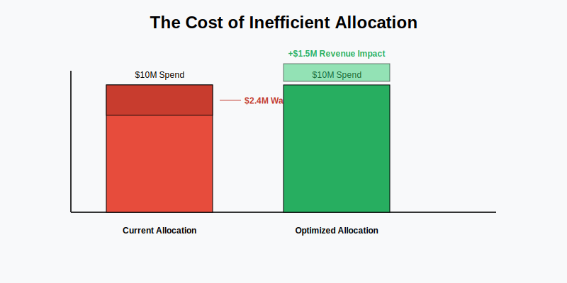
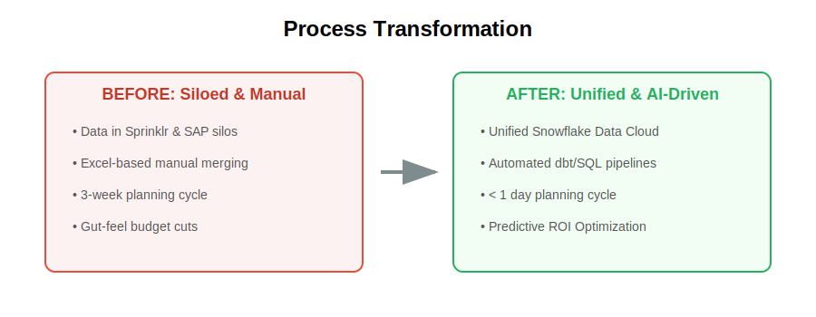
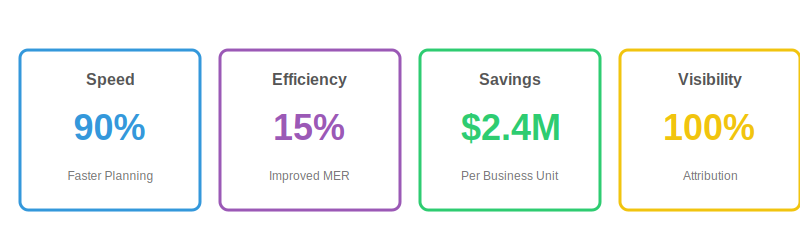
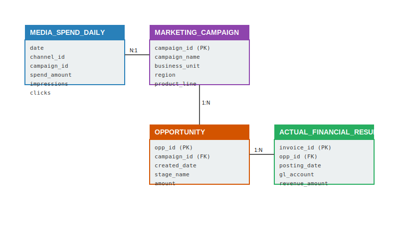
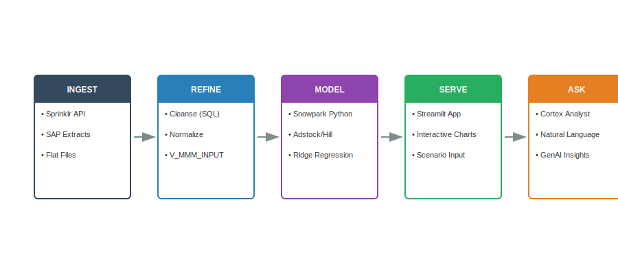
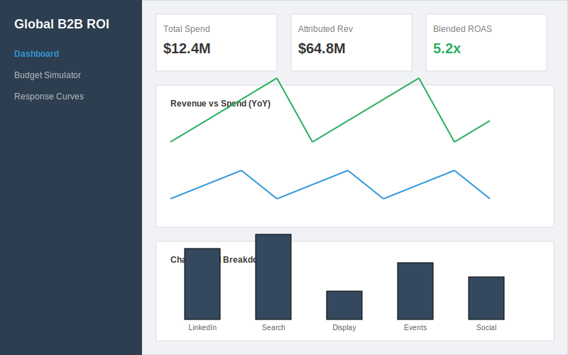
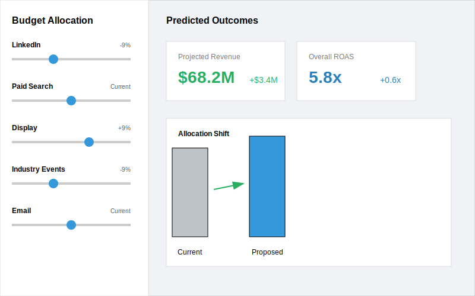
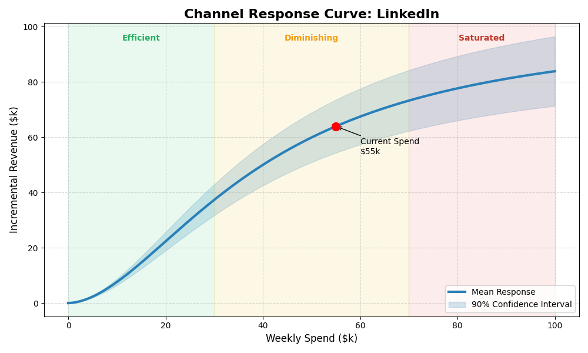

# Global B2B Marketing Mix & ROI Engine: Optimize Spend with Snowflake

For global manufacturers, fragmented marketing data across regions and channels hides the true drivers of revenue.

---

## The Cost of Inaction



**P&G's "Digital Media Transparency Crisis" (2017–2019)** exposed how even sophisticated marketers waste billions when attribution data lives in silos. P&G cut $200M in digital ad spend and saw *zero* impact on sales growth—proving their existing measurement was blind to what actually drove revenue.

B2B manufacturers face the same challenge at a different scale: **$2.4M in wasted annual spend** per business unit due to inefficient "peanut-butter" budget allocation. Marketing leaders struggle to correlate top-of-funnel digital spend with booked revenue that lags by 6–18 months in SAP.

---

## The Problem in Context

- **Fragmented Attribution.** Ad spend (Sprinklr) and Revenue (SAP) live in silos, making ROI calculation manual and delayed.
- **Long Sales Cycles.** The 9-month lag between a LinkedIn impression and a Distributor Invoice obscures cause-and-effect.
- **Blind Budgeting.** Without data-driven curves, regional leads cut spend indiscriminately, risking future pipeline.
- **Lost Signals.** Validating the impact of "soft" metrics like Brand Sentiment (PMI/SOV) on hard revenue is practically impossible.

---

## The Transformation



From spreadsheet-based lagging indicators to AI-driven predictive allocation. Regional marketers stop guessing and start optimizing with real-time model coefficients.

---

## What We'll Achieve

- **15% Improvement in MER.** (Marketing Efficiency Ratio) by shifting budget to high-marginal-ROI channels.
- **90% Faster Planning.** Reduce quarterly planning cycles from weeks to days with automated data prep.
- **Unified Visibility.** A single view of ROI across Industrial, Healthcare, and Consumer business units.
- **Predictive Agility.** Simulate "What-If" scenarios to defend budget decisions to the CFO.

---

## Business Value



| Metric | Value | Impact |
|--------|-------|--------|
| **Speed** | 90% | Faster quarterly planning |
| **Efficiency** | 15% | Improved MER |
| **Savings** | $2.4M | Annual savings per business unit |
| **Visibility** | 100% | Cross-BU attribution coverage |

Unlocking millions in incremental revenue by optimizing the marketing mix without increasing top-line budget.

---

## Why Not Last-Click Attribution?

A skeptical reviewer might ask: *"Why build a statistical model when we can just track conversions?"*

**Last-click attribution fails for B2B because:**

| Challenge | Reality | Why Last-Click Fails |
|-----------|---------|---------------------|
| **6-18 month sales cycles** | A LinkedIn impression in January may not convert until September | Last-click credits only the final touchpoint before close |
| **Multi-stakeholder buying** | 6-10 people influence a B2B purchase | Each sees different channels; no single "converter" |
| **Offline revenue recognition** | SAP invoices lag deals by weeks/months | Digital tracking can't connect to ERP revenue |
| **Brand effects** | Display ads build awareness that Search captures | Last-click gives 100% credit to Search, 0% to Display |

**Marketing Mix Modeling (MMM)** solves this by using *statistical regression* to estimate the causal effect of each channel on revenue—accounting for time delays, diminishing returns, and confounding factors.

---

## The Science Behind the Model

This solution implements four core techniques from econometrics and marketing science. Each addresses a specific challenge that simpler approaches miss.

### 1. Geometric Adstock (Carryover Effect)

**Problem:** A $100k LinkedIn campaign in Week 1 doesn't just affect Week 1. In B2B, someone sees an ad, researches for weeks, then converts.

**Solution:** Spread each week's spend across future weeks with exponential decay:

```
Week 1: $100k spend → Effective: $100k
Week 2: $0 spend    → Effective: $70k  (70% carryover)
Week 3: $0 spend    → Effective: $49k  (70% × $70k)
Week 4: $0 spend    → Effective: $34k  ...and so on
```

**The decay rate (θ) varies by channel:**
- LinkedIn B2B: θ = 0.7–0.9 (long consideration cycle, effects persist 6-8 weeks)
- Paid Search: θ = 0.1–0.3 (immediate intent, fast decay)
- Display: θ = 0.4–0.6 (awareness building, medium decay)

The model *learns* the optimal θ for each channel—no manual configuration required.

---

### 2. Hill Saturation (Diminishing Returns)

**Problem:** Doubling spend doesn't double revenue. The 10th impression to the same person has near-zero value.

**Solution:** Apply an S-curve (Hill function from pharmacology) that flattens at high spend:

```
Response │              ●●●●●●●●●●●●  ← Saturation (flat)
   ▲     │         ●●●●●
   │     │      ●●●                    ← Efficient zone
   │     │    ●●
   │     │  ●●
   │     │●●───────────────────────► Spend
           γ (half-saturation point)
```

**Two learned parameters per channel:**
- **γ (gamma):** Spend level where response = 50% of maximum. If γ = $50k, you're at half-effectiveness at $50k/week.
- **α (alpha):** Steepness of the curve. Higher α = sharper transition from efficient to saturated.

This enables **marginal ROI calculation**: "What's the *next* dollar worth?" rather than just average ROI.

---

### 3. Evolutionary Hyperparameter Optimization

**Problem:** With 20 channels × 3 parameters (θ, α, γ) = 60 parameters, grid search is impossible. Traditional gradient descent doesn't work because the objective isn't smooth.

**Solution:** Nevergrad's TwoPointsDE (Differential Evolution)—an evolutionary algorithm that:

1. Starts with a population of random parameter guesses
2. "Breeds" new guesses by combining good performers
3. Keeps the best, discards the worst
4. Repeats for 500 iterations

**Why this matters:** Unlike black-box AutoML, we optimize *interpretable* marketing parameters. The output isn't just "predicted revenue"—it's *why* each channel contributes with explainable decay rates and saturation points.

---

### 4. Ridge Regression with Positive Constraints

**Problem:** Marketing channels are correlated (LinkedIn and Display both spike in Q4). Standard regression produces unstable, uninterpretable coefficients.

**Solution:** Ridge Regression with L2 penalty:

- **Handles multicollinearity:** When channels move together, Ridge shrinks coefficients toward zero rather than producing wild estimates.
- **Interpretable:** Each coefficient represents "revenue per unit of saturated, adstocked spend."
- **Economically valid:** We penalize negative coefficients—marketing should never *hurt* revenue.

**Why not Lasso?** Lasso (L1) zeros out channels entirely. We want every channel's contribution estimated, even if small.

**Why not Neural Networks?** Interpretability. A CMO needs to explain *why* LinkedIn gets more budget, not just that the model said so.

---

## Validation: Why You Should Trust This Model

Skeptical reviewers ask: *"How do I know this isn't just overfitting?"*

### Time-Series Cross-Validation

Unlike standard k-fold CV (which randomly shuffles data), we **never let the model see future data**:

```
Fold 1: Train [Week 1-52]  → Test [Week 53-65]   (predict Q1 next year)
Fold 2: Train [Week 14-65] → Test [Week 66-78]  (predict Q2 next year)
Fold 3: Train [Week 27-78] → Test [Week 79-91]  (predict Q3 next year)
```

This mimics real-world use: *"Given everything up to today, how well can we predict next quarter?"*

**Quality thresholds:**
| CV MAPE | Interpretation |
|---------|----------------|
| < 10% | Excellent—model is highly predictive |
| 10-20% | Good—suitable for budget optimization |
| 20-30% | Acceptable—directional insights only |
| > 30% | Poor—investigate data quality |

### Bootstrap Confidence Intervals

We don't just report "LinkedIn ROI = 3.2x". We report:

> **LinkedIn ROI = 3.2x [2.8, 3.6] at 90% confidence**

**How it works:**
1. Resample data 100 times with replacement
2. Re-fit the model each time
3. Collect distribution of ROI estimates
4. Report 5th and 95th percentiles

**IS_SIGNIFICANT flag:** When the entire confidence interval is above zero, we're confident the channel has positive ROI—not just statistical noise.

---

## From Average ROI to Marginal ROI

A channel with 5x average ROI might already be saturated with 0.5x marginal ROI. **Budget decisions are about the *next* dollar, not past dollars.**

### Response Curves with Efficiency Zones

```
Revenue │              ●●●●●●●●●●●●  ← SATURATED (mROI < 0.8)
Contrib │         ●●●●●               Next dollar returns < $0.80
  ▲     │      ●●●                  ← DIMINISHING (0.8 < mROI < 1.5)
  │     │    ●●                       Still positive but flattening
  │     │  ●●                       ← EFFICIENT (mROI > 1.5)
  │     │●●                           Every dollar returns > $1.50
  └─────┴──────────────────────────► Spend
```

The model outputs response curves with:
- **Marginal ROI at each spend level**
- **Confidence bands** from bootstrap
- **Efficiency zone classification** (Efficient / Diminishing / Saturated)

---

## Budget Optimizer

Given learned response curves, how should we reallocate spend?

### Constrained Optimization Problem

```
MAXIMIZE: Total predicted revenue = Σ (saturated_response × coefficient)
SUBJECT TO:
  1. Total budget unchanged (budget neutral)
  2. Each channel can only change ±30% (realistic for CMO approval)
  3. All spend ≥ 0
```

**Why constraints matter:** Without them, the optimizer says "put 100% in LinkedIn." But:
- CMOs can't pivot all spend in one quarter
- Vendor contracts require minimum commitments
- Channel inventory is finite

### Economic Principle: Equalize Marginal Returns

The optimal allocation **equalizes marginal ROI across channels**. If LinkedIn has mROI = 3.0 and Display has mROI = 1.5, shift budget until they converge (~2.0 each).

Output: **Predicted revenue lift** from reallocation (e.g., "+$2.4M without increasing total spend").

---

## Why Snowflake

- **Unified data foundation.** Integrate Sprinklr, Salesforce, and SAP data in one governed place without ETL friction.
- **Performance that scales.** Train complex models on full historical data using Snowpark Python—no data movement.
- **Collaboration without compromise.** Share ROI models securely across regional teams without data copying. Row-level security ensures regions see only their data.
- **Built‑in AI/ML and apps.** Democratize insights via Cortex Analyst (natural language) and Streamlit dashboards.

---

## The Data



### Source Tables

| Table | Type | Records | Purpose |
|-------|------|---------|---------|
| `MEDIA_SPEND_DAILY` | Fact | ~100k | Daily ad spend, impressions, clicks by channel/campaign |
| `ACTUAL_FINANCIAL_RESULT` | Fact | ~50k | Invoiced revenue from ERP (SAP) at line-item grain |
| `OPPORTUNITY` | Fact | ~20k | CRM pipeline stages to track intermediate conversion |
| `MARKETING_CAMPAIGN` | Dim | ~500 | Metadata linking campaigns to Business Groups |

### Model Input View

The `V_MMM_INPUT_WEEKLY` view aggregates to weekly grain with:
- Spend, impressions, clicks per Channel × Region × Product
- Revenue from SAP aligned to fiscal weeks
- Control variables: PMI, Competitor SOV, seasonality (Fourier terms)

### Data Characteristics

- **Freshness:** Weekly batch updates to align with fiscal reporting cycles.
- **Trust:** Row-level access policies ensure Regional leads only see their Business Unit's data.
- **Relationships:** Campaigns link to Opportunities; Opportunities link to Financial Results.

---

## Solution Architecture



- **Ingest:** Raw data from Sprinklr/SAP lands in Snowflake `RAW` schema.
- **Refine:** SQL transforms data into the `ATOMIC` schema (normalized, governed).
- **Model:** Snowpark Python notebook trains MMM with Adstock + Hill + Ridge.
- **Serve:** Streamlit App consumes `MMM.MODEL_RESULTS` for visualization.
- **Ask:** Cortex Analyst enables natural language queries on the semantic model.

### Model Outputs

| Table | Purpose |
|-------|---------|
| `MMM.MODEL_RESULTS` | Channel-level ROI with confidence intervals, marginal ROI, learned parameters |
| `MMM.RESPONSE_CURVES` | 100-point curves per channel with CI bands and efficiency zones |
| `MMM.MODEL_METADATA` | Model version, quality metrics (R², CV MAPE), hyperparameter settings |

---

## How It Comes Together

1. **Ingest & Normalize.** Load and join spend/revenue data. → `sql/03_load_data.sql`
2. **Train MMM Model.** Optimize Adstock/Saturation params, fit Ridge Regression. → `notebooks/01_mmm_training.ipynb`
3. **Validate.** Time-series CV (MAPE < 15%) + Bootstrap CI (90%). → [Notebook Cell 6-9]
4. **Deploy App.** Launch Interactive ROI Dashboard. → `streamlit/mmm_roi_app.py`
5. **Simulate Spend.** Adjust sliders to see marginal ROI impact. → [Streamlit Page 2]
6. **Ask Questions.** "Show me ROAS by Channel for EMEA." → [Cortex Analyst]

---

## Key Visualizations

### ROI Dashboard



Exec-level view of Total Spend, Attributed Revenue, and Blended ROAS. The dashboard surfaces channel performance across all regions and business units in a single pane.

### Budget Simulator



Interactive "Flight Simulator" allowing users to adjust channel spend (±30%) and see real-time predicted revenue impact based on marginal ROI curves.

### Response Curves



Visualize the spend → revenue relationship for each channel with:
- Shaded confidence bands (90% bootstrap CI)
- Efficiency zone markers (Efficient / Diminishing / Saturated)
- Current spend position with marginal ROI annotation

### Application Features

The application provides:

- Executive-level KPI cards with spend, revenue, and ROAS metrics
- Interactive channel-level ROI breakdowns with drill-down capability
- What-if scenario modeling with instant marginal ROI predictions
- Natural language queries via Cortex Analyst integration
- Learned parameter inspection (decay rates, saturation points)

---

## Alternatives Considered

| Approach | Why Not |
|----------|---------|
| **Last-click attribution** | Doesn't work for 6-18 month B2B sales cycles |
| **Multi-touch attribution (MTA)** | Requires user-level tracking; breaks with privacy regulations |
| **Robyn (Meta)** | Bayesian approach is 10x slower; requires MCMC tuning expertise |
| **LightweightMMM (Google)** | JAX-based; less compatible with Snowflake Python environment |
| **Neural networks** | Black box; CMO can't explain *why* a channel gets more budget |

This solution uses **interpretable, production-ready techniques** that run natively in Snowflake with clear explanations for every coefficient.

---

## Call to Action

**Run the Demo**

```bash
# 1. Deploy Infrastructure & Data
./deploy.sh

# 2. Train the Model
./run.sh main

# 3. Launch the App
./run.sh streamlit
```

**Customize for Your Data**

- Adjust `geo_level` in notebook config to model at GLOBAL, SUPER_REGION, or COUNTRY granularity.
- Modify adstock decay priors if you have domain knowledge about channel effects.
- Add macro indicators (PMI, inflation) to control for economic conditions.
- Extend the semantic model in `cortex/mmm_semantic_model.yaml` for custom metrics.

---

*From peanut-butter spreading to precision-guided growth—with interpretable, validated models running natively in Snowflake.*
